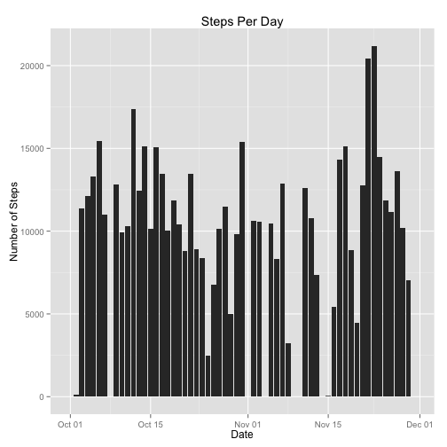
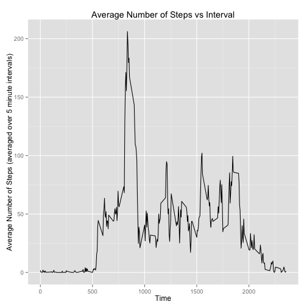
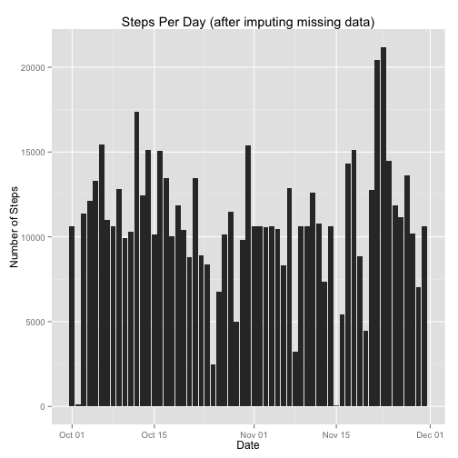
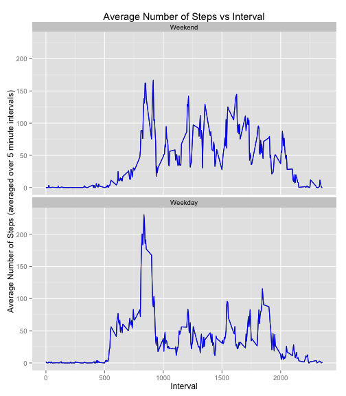

    
    
### Load and preprocess the data

1. Load the data into a datatable ad.

2. Change the dt column class to IDate from character.

3. Set (dt, intv) as key to the datatable.


```r
require(data.table)
require(ggplot2)

# Unzip activity.zip to extract activity.csv

unzip("activity.zip", junkpaths=TRUE)

# Read activity.csv into a datatable ad with fread. 

ad <- fread("activity.csv")

# Set data table column names.

setnames(ad, c("step", "dt", "intv"))

# Change dt class from character to IDate

ad[, dt := as.IDate(dt, format="%Y-%m-%d")]
```

```
##        step         dt intv
##     1:   NA 2012-10-01    0
##     2:   NA 2012-10-01    5
##     3:   NA 2012-10-01   10
##     4:   NA 2012-10-01   15
##     5:   NA 2012-10-01   20
##    ---                     
## 17564:   NA 2012-11-30 2335
## 17565:   NA 2012-11-30 2340
## 17566:   NA 2012-11-30 2345
## 17567:   NA 2012-11-30 2350
## 17568:   NA 2012-11-30 2355
```

```r
# Set date and interval as key to the datatable.

setkey(ad, dt, intv)
```
     

### Calculate total number of steps taken per day   

1. Make a histogram of total number of steps per day.

2. Calculate mean and median total number of steps per day.


```r
# Sad is summary datatable containing total number of step (tot.step)
# grouped by dt.

sad <- ad[, list(tot.step = sum(step, na.rm=TRUE)), by=dt]

# Plot histogram.

qplot(dt, tot.step, data=sad, geom="histogram", main="Steps Per Day",
      stat="identity" , xlab="Date", ylab="Number of Steps")
```

 

```r
# Calculate mean and median total number of steps per day.

mm1 <- sad[, list(Mean = mean(tot.step), Median = median(tot.step))]
```
    

#### Total number of steps
- Mean = 9354.2295
- Median = 10395
    
    
### Average daily activity pattern    

1. Make a time series plot of the 5 minute interval and average number of 
steps taken, averaged across all days.

- Create a datatable mad with 2 columns: intv and avg.step. 
- Set intv as the key to the mad datatable.
- The avg.step column will contain average number of steps 
averaging over all days for that particular interval.


```r
# mad datatable will have two columns: intv, avg.step; intv will be the key.

mad <- ad[, list(avg.step = mean(step, na.rm=TRUE)), keyby=intv]

# Plot the average no. of steps at different hours of the day graph.

qplot(intv, avg.step, data=mad, geom="line", 
      main="Average Number of Steps vs Interval",
      stat="identity", xlab="Time", 
      ylab="Average Number of Steps (averaged over 5 minute intervals)"
      )  
```

 

```r
# Find the time interval with the maximum average no. of steps.
# madmax datatable will have two columns: Max.Avg.Step.Interval, 
# and Max.Avg.Step.

madmax <- mad[avg.step == max(avg.step), list(Max.Avg.Step.Interval = intv, 
                                    Max.Avg.Step = avg.step)]
```
      


- The 5-minute interval (averaged across all days) with the 
maximum number of steps = 835
     


### Imputing missing values   

Calculate the number of rows in ad datatable with missing values.

```r
na.cnt <- ad[is.na(step), .N]
```
   


1. Total number of rows with missing values = 2304

2. Make a copy of the ad datatable to fad.

3. Fill the NA values of fad\$step with mad\$avg.step for that interval. Note, 
however, fad\$step is integer, whereas mad\$avg.step is numeric, so 
mad\$avg.step will be converted to integer using the as.integer function.

4. Plot a new histogram of total number of steps per day after imputing 
missing values.

5. Calculate the new mean and median of total number of steps taken each day.


```r
# Make a copy of ad datatable to fad.

fad <- copy(ad)

# Set intv as the key for fad, so that it can be joined with mad, later.

setkey(fad, intv)

# Update NA values: If fad$step is NA, update it with mad$avg.step, 
# else update with its old value.

fad[mad, step := ifelse(is.na(step), as.integer(avg.step), step)]
```

```
##        step         dt intv
##     1:    1 2012-10-01    0
##     2:    0 2012-10-02    0
##     3:    0 2012-10-03    0
##     4:   47 2012-10-04    0
##     5:    0 2012-10-05    0
##    ---                     
## 17564:    0 2012-11-26 2355
## 17565:    0 2012-11-27 2355
## 17566:    0 2012-11-28 2355
## 17567:    0 2012-11-29 2355
## 17568:    1 2012-11-30 2355
```

```r
# At this point all the missing values are filled in.

# Calculate total number of steps, group by dt and store it in sfad
# datatable. The sfad datatable will have 2 columns - dt, tot.step.

sfad <- fad[, list(tot.step = sum(step)), keyby=dt]

# Plot a new histogram of total number of steps vs. dt.

qplot(dt, tot.step, data=sfad, geom="histogram", 
      main="Steps Per Day (after imputing missing data)",
      stat="identity" , xlab="Date", ylab="Number of Steps")
```

 

```r
# Calculate new mean and median of total number of steps taken per day.
       
mm2 <- sfad[, list(Mean = mean(tot.step), Median = median(tot.step))]
```
    
    
Concatenate the old and new mean and median values and show in a tabular format.


```r
require(xtable)

# rbind the two datatables containing the mean and median total steps per day.

mm <- rbindlist(list(mm1, mm2))
mmd <- as.data.frame(mm)

# Add more meaningful rownames and column names.

row.names(mmd) <- c(" Before imputing missing values ", 
                         " After imputing missing values ")
names(mmd) <- c( "Mean of Total No. of Steps per Day", 
                 "Median of Total No. of Steps per Day")

# Print as a HTML table.

print(xtable(mmd), type="html")
```

<!-- html table generated in R 3.1.0 by xtable 1.7-3 package -->
<!-- Fri Jul 18 11:37:32 2014 -->
<TABLE border=1>
<TR> <TH>  </TH> <TH> Mean of Total No. of Steps per Day </TH> <TH> Median of Total No. of Steps per Day </TH>  </TR>
  <TR> <TD align="right">  Before imputing missing values  </TD> <TD align="right"> 9354.23 </TD> <TD align="right"> 10395 </TD> </TR>
  <TR> <TD align="right">  After imputing missing values  </TD> <TD align="right"> 10749.77 </TD> <TD align="right"> 10641 </TD> </TR>
   </TABLE>

     
     
The mean and median total number of steps differ from old values after 
imputing missing values.    

The new mean and median number of steps have increased.    
     

#### Plot total number of steps per day conditioning on weekday vs weekends 
      

1. Create a new column wdy in fad datatable which will contain a factor
with two possible values - Weekday or Weekend.

2. Calculate mean and median of total number of steps per day grouped by
intv and wdy (interval and weekday/weekend).


```r
# Function wday() returns 1 = Sun, 2=Mon...7=Sat.
# Create new column wdy in fad datatable.

fad[, wdy := factor(ifelse(wday(dt) %in% c(1, 7), 0L, 1L),
                    levels= c(0L, 1L),
                    labels= c("Weekend", "Weekday"), ordered=TRUE)]
```

```
##        step         dt intv     wdy
##     1:    1 2012-10-01    0 Weekday
##     2:    0 2012-10-02    0 Weekday
##     3:    0 2012-10-03    0 Weekday
##     4:   47 2012-10-04    0 Weekday
##     5:    0 2012-10-05    0 Weekday
##    ---                             
## 17564:    0 2012-11-26 2355 Weekday
## 17565:    0 2012-11-27 2355 Weekday
## 17566:    0 2012-11-28 2355 Weekday
## 17567:    0 2012-11-29 2355 Weekday
## 17568:    1 2012-11-30 2355 Weekday
```

```r
# Create a new summary table wsfad based on fad grouped by wdy and intv.

wsfad <- fad[, list(avg.step = mean(step)), by = list(intv, wdy)]

# Plot a graph of average number of steps by interval conditioned on
# weekday vs. weekend.

qplot(intv, avg.step, 
      data=wsfad, geom="line", 
      main="Average Number of Steps vs Interval",
      stat="identity", xlab="Interval", 
      ylab="Average Number of Steps (averaged over 5 minute intervals)"
      ) + facet_wrap(~ wdy, nrow=2) + geom_line(colour="blue")
```

 
    
     
     
Activity patterns differ between weekdays and weekends.
